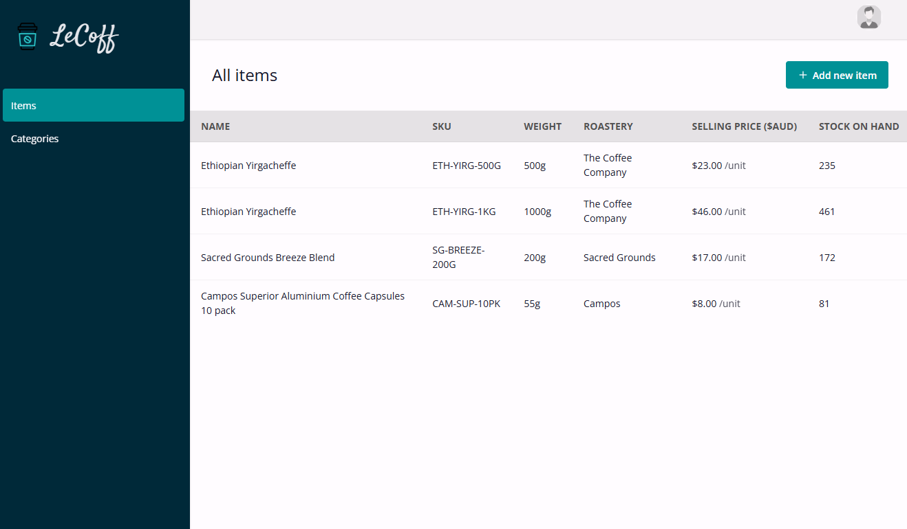
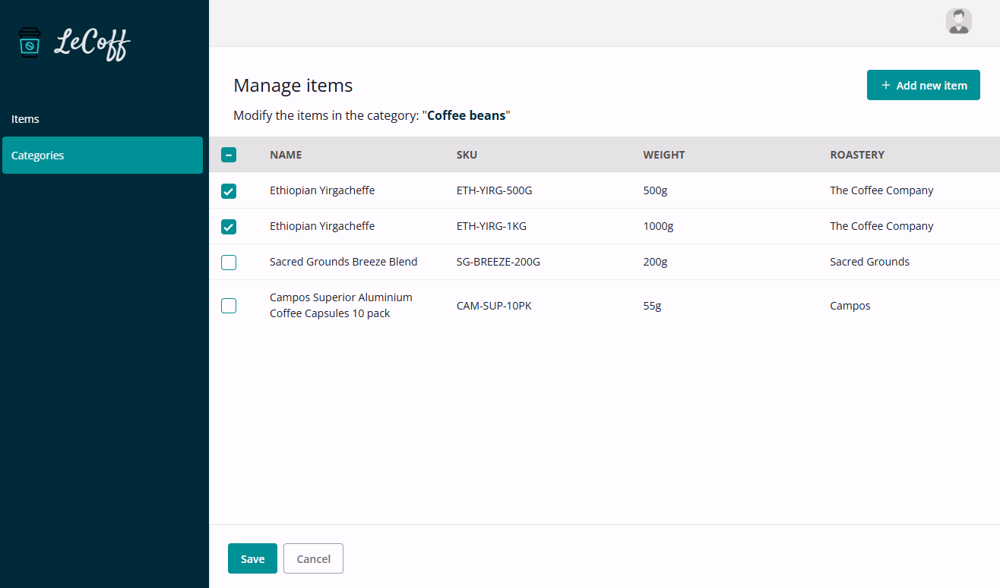
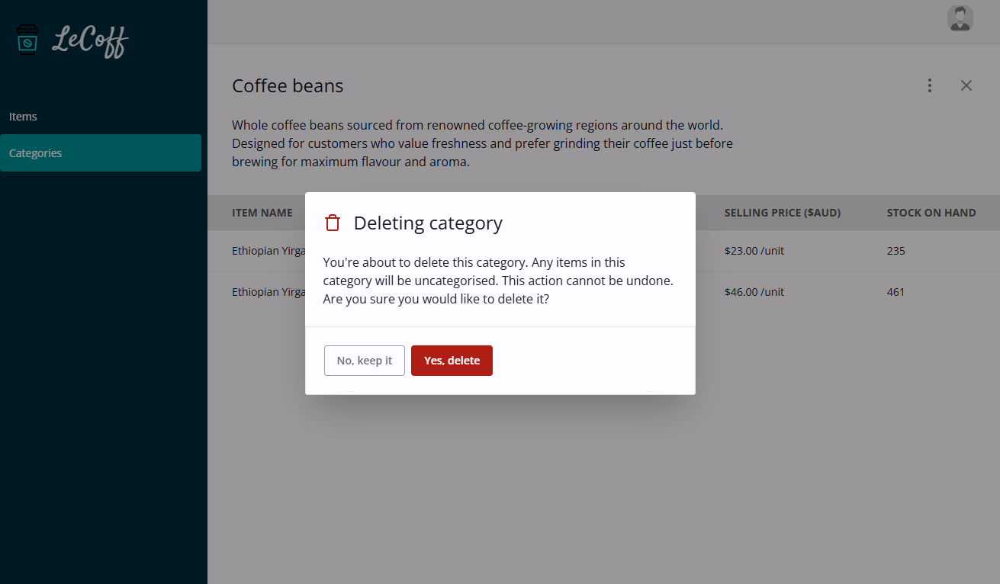

<a id="readme-top"></a>

<!-- PROJECT SHIELDS -->

[![Issues][issues-shield]][issues-url]
![MIT License][license-shield]
[![LinkedIn][linkedin-shield]][linkedin-url]

<!-- PROJECT LOGO -->
<br />
<div align="center">
  <a href="https://github.com/henrylin03/coffee-inventory">
    
  </a>

<h3 align="center">LeCoff</h3>

  <p align="center">
    Web app to help vendors of coffee beans and coffee products to manage their inventory.
    <br />
    <br />
    <a href="https://github.com/henrylin03/coffee-inventory/issues/new" target="_blank">Add issue</a>
  </p>
</div>

<!-- ABOUT THE PROJECT -->

## About

Full-stack, inventory management web app to enable basic CRUD operations for items, and categories.

Built in Express.js (Node.js), with PostgreSQL database (`pg` integration with Express.js) and EJS templating.

This project is part of [The Odin Project's](https://www.theodinproject.com/) "Full Stack JavaScript" course. This is also my first full-stack project, so largely the focus has been just trying to get things built. It's also the first time I've used TailwindCSS as a front-end web developer 😅 (i love it btw).

## Screenshots

View of all items in inventory:


View of managing the adding/removing of composite items (including creating a fresh item to the inventory) to a given category (here it is for "Coffee beans").


View of a confirmation modal for user to confirm they'd like to delete a category. Deleting a category also "orphans" its items.


### Built with

[](https://expressjs.com/) [](https://ejs.co/) [](https://www.postgresql.org/) [](<[#](https://tailwindcss.com/)>)

## Running locally

1. Fork then clone this repository,
2. Install all packages and dependencies
   ```bash
   npm i
   ```
3. Run PostgreSQL in terminal by running `psql`, and create the database:
   ```postgres
   CREATE DATABASE coffee_inventory;
   ```
   You can verify if db was created using `\l`
4. Create a `.env` file in root of repository with your Postgres details. It should look like this:
   ```bash
    USER_NAME: "your_username"
    PASSWORD: "your_password"
   ```
5. Start development server and TailwindCSS (used for styling) build processes. You will need two terminals - one each - for these:

   ```bash
   npm run dev
   ```

   ```bash
   npm run build:css
   ```

## Licence

Distributed under MIT Licence.

## Acknowledgements

- Branding icon (including favicon) is from [Flaticon](https://www.flaticon.com/)
- All other (functional) icons are from [Lucide](https://lucide.dev/icons/)
- Blank avatar image is from [Vecteezy](https://www.vecteezy.com/vector-art/45944199-male-default-placeholder-avatar-profile-gray-picture-isolated-on-background-man-silhouette-picture-for-user-profile-in-social-media-forum-chat-greyscale-illustration)
- Markdown badges by [ileriayo](https://github.com/Ileriayo/markdown-badges)

<!-- MARKDOWN LINKS & IMAGES -->

[issues-shield]: https://img.shields.io/github/issues/henrylin03/coffee-inventory.svg?style=for-the-badge
[issues-url]: https://github.com/henrylin03/coffee-inventory/issues
[license-shield]: https://img.shields.io/github/license/henrylin03/coffee-inventory.svg?style=for-the-badge
[linkedin-shield]: https://img.shields.io/badge/-LinkedIn-black.svg?style=for-the-badge&logo=linkedin&colorB=555
[linkedin-url]: https://www.linkedin.com/in/henrylin03/
